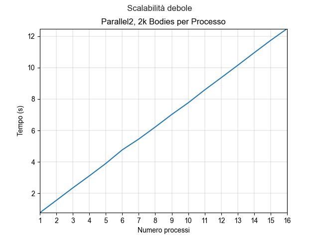

# Introduction
In the N-Body problem, we are faced with the challenge of determining the positions and velocities of a collection of interacting particles over time. Imagine, for example, an astrophysicist who wishes to know the positions and velocities of a group of stars, or a chemist interested in the positions and velocities of a collection of molecules or atoms.

To tackle this task we use a solver, a program that can find the solution to the problem by simulating particle behavior. The required input includes the mass, position, and velocity of each particle at the beginning of the simulation, while the output typically provides the positions and velocities of each particle at a sequence of times or at the end of a user-specified time interval.

For the purposes of this project, it was chosen to implement the solver by serving the trivial quadratic solution with respect to the number of particles. However, it should be noted that there are also other more efficient solutions, for example, one that uses the Barnes-Hut algorithm.

The solver was tested on the Google Cloud platform on a cluster of 4 e2-standard-8 instances. Each instance offers 32GB of RAM and 8vCPUs; of these, only 4 are actually physical cores, for a total of 16 actual cores for the entire cluster.

Translated with DeepL.com (free version)

# Proposed solutions
The solver was implemented 2 times.
Both versions parallel the sequential version of the solver provided to us at the same time as the project assignment.
The difference between the 2 solutions lies in the way processes communicate and synchronize with each other.
 
## Solution 1
In this solution, the simplest and most straightforward approach was followed.

At each iteration, the entire array containing information about all the bodies in the problem is broadcast to all the processes participating in the computation of the solution.

Each of them is able to know which part of this array it has to compute. For each body belonging to its part of the array, the process updates the velocities.

The information thus computed is collected by the master process, which finally updates the position of each body.

## Solution 2
Solution 2 is more creative.

Initially, the master process divides the body array into as many parts as there are processes participating in the computation. Each process is sent a part of the array.

At each iteration, each process:
* sends its own bodies in broadcast to all other processes;
* calculates the velocities of its own bodies considering only the forces between them;
* receives from each process n the bodies of process n;
* at each reception from process n, updates the velocities of its own bodies considering only the forces between them and the bodies of process n;
* having completed all the receptions and related velocities computations, it updates the positions of its own bodies.

At the end of n iterations (number decided by the user), the master process collects all the bodies for printing the results.

# Implementation details
The implementation of the two solutions was written in C, making use of the OpenMPI library to parallelize operations. It is an open source implementation of MPI developed and maintained by a consortium of research and industry partners. MPI is a standardized, portable message-passing standard designed to run on parallel computing architectures. It defines the syntax and semantics of libraries used to write portable message-passing programs in C and other programming languages.

Some snippets/functions are used by both solutions. Let's look at them:

## Body structure
```
typedef struct
{
    float x, y, z, vx, vy, vz;
} Body;
```
This is the structure that represents the individual Body.
Each Body consists of the *positions* (.x, .y, .z) and the *velocities* (.vx, .vy, .vz).

## int compute_sendreceivecount_withoffset
```
int compute_sendreceivecount_withoffset(int sendbufsize, int send_recv_count[], int offsets[], int size)
{

    int elementsPerProcess = sendbufsize / (size);
    int remainder = sendbufsize % (size);

    // Inizializzo array
    send_recv_count[0] = elementsPerProcess;
    offsets[0] = 0;
    for (int i = 1; i < size; i++)
    {
        send_recv_count[i] = elementsPerProcess;
        if (remainder > 0)
        {
            send_recv_count[i]++;
            remainder--;
        }
        offsets[i] = offsets[i - 1] + send_recv_count[i - 1];
    }
}
```
This function calculates the number of objects to be computed for each process.
The computation is performed by equally distributing the same number of objects over each process.
If this is not possible (i.e., if the nObjects/nProcesses division has no remainder 0) the remaining objects are distributed equally over the first m processes, with m equal to the remainder of the division above.

In the code, *sendbufsize* is the total number of objects to be processed and *size* is the number of processes participating in the calculation.
The two arrays *send_recv_count* and *offsets* are used to store the output of the function:
* send_recv_count[i] will contain the number of objects to be processed by the process with *rank* i;
* offsets[i] will contain the index of the first object to be processed by the process with *rank* i in the array containing all objects; it is used as the *displs* parameter in calls to collective communication functions provided by MPI.


## randomizeBodies
```
void randomizeBodies(Body p[], int n)
{
    for (int i = 0; i < n; i++)
    {
        p[i].x = 2.0f * (rand() / (float)RAND_MAX) - 1.0f;
        p[i].y = 2.0f * (rand() / (float)RAND_MAX) - 1.0f;
        p[i].z = 2.0f * (rand() / (float)RAND_MAX) - 1.0f;
        p[i].vx = 2.0f * (rand() / (float)RAND_MAX) - 1.0f;
        p[i].vy = 2.0f * (rand() / (float)RAND_MAX) - 1.0f;
        p[i].vz = 2.0f * (rand() / (float)RAND_MAX) - 1.0f;
    }
}
```
This function pseudo-randomly initializes n bodies within the array p.
It is important to note that different executions of the program correspond to equal initializations of the first n bodies (i.e., by executing the program with n bodies and then with n + x bodies, the first n bodies of the second execution are initialized with the same values as the n bodies of the first execution). This is true because the rand() function generates numbers from a seed, and by fixing the seed the sequence of numbers generated remains constant. In our case, the seed used by the rand() function is the default seed, which is 1.

## bodiesPosition
```
void bodiesPosition(Body p[], int nBodies, float dt)
{
    for (int i = 0; i < nBodies; i++)
    { // integrate position
        p[i].x += p[i].vx * dt;
        p[i].y += p[i].vy * dt;
        p[i].z += p[i].vz * dt;
    }
}
```
This function updates the positions of *nBodies* bodies within the array p.
It is called at the end of each iteration, but:
* In Solution 1, it is called by the master process that updates the positions of all bodies in the problem;
* In Solution 2, it is called by each process that updates the positions of only its own bodies.

## main
Much of the main function is the same in the two solutions.
```
// Init MPI
MPI_Init(&argc, &argv);

// Compute size and rank
int rank, size;
MPI_Comm_rank(MPI_COMM_WORLD, &rank);
MPI_Comm_size(MPI_COMM_WORLD, &size);
```
We initialize OpenMPI and and save the number of processes participating in the computation (*size*) and the rank of the local process (*rank*).

```
// Take parameters from input
int nBodies = argc > 1 ? atoi(argv[1]) : DEFAULT_NBODIES;
int nIters = argc > 2 ? atoi(argv[2]) : DEFAULT_NITERS;
const char *resultsFileName = argc > 3 ? argv[3] : DEFAULT_FILENAME;
```
We reads from the command line arguments some useful parameters for execution:
* *nBodies*: number of bodies as input to the problem.
* *nIters*: number of iterations to compute; each iteration computes the velocities and locations of the bodies at an interval of 0.01s from the previous iteration;
* *resultsFileName*: the name of the file within which to write the final results of the execution.

```
// Compute sendcount and offsets
int sendrecvcount[size];
int offsets[size];
compute_sendreceivecount_withoffset(nBodies, sendrecvcount, offsets, size);
```
The number of bodies to be computed and the starting index in the complete bodies array are calculated for each process.

```
// Create new MPI_Datatype for Body
MPI_Datatype MPI_Body;
MPI_Type_contiguous(6, MPI_FLOAT, &MPI_Body);
MPI_Type_commit(&MPI_Body);
```
A new MPI_Datatype representing the Body structure is created. The choice of creating an MPI_Datatype allowed MPI's collective communication functions to be used with greater logical and syntactic simplicity.

```
// Init bodies pos & vel
if (rank == 0)
{
    randomizeBodies(p, nBodies);
}
```
We initialize the Body *p* array from the master process.

## computePositions 
The big implementation difference between the two solutions lies in the *computePositions* function.

### Solution 1
```
void computePositions(Body p[], int nBodies, int nIters, MPI_Datatype datatype, float dt, int offsets[], int sendrecvcount[], int rank)
{
    for (int iter = 0; iter < nIters; iter++)
    {

        // Bcast complete array to slaves
        MPI_Bcast(p, nBodies, datatype, 0, MPI_COMM_WORLD);

        // Debug
        debugPrint("After Bcast", sendrecvcount[rank], p, rank);

        // Compute forces, each slave just his part
        bodiesForce(p, nBodies, offsets[rank], sendrecvcount[rank], dt);

        // Gather results from slaves to master
        MPI_Gatherv(&p[offsets[rank]], sendrecvcount[rank], datatype, p, sendrecvcount, offsets, datatype, 0, MPI_COMM_WORLD);

        // Debug
        debugPrint("After bodiesForce", nBodies, p, rank);

        // If master
        if (rank == 0)
        {
            bodiesPosition(p, nBodies, dt);
        }
    }
}
```
In this version of *computePositions* at each iteration the Broadcast from the master to all other processes of the complete array of bodies is performed.
Each process then calls the *bodiesForce*, which updates the velocities *only of its bodies* but having *all* bodies available.
The bodies thus updated are taken back through the Gather by the master process.
It then updates the *positions* of all the bodies. 

### Solution 2
```
void computePositions(Body p[], Body myBodies[], int nLocalBodies, int nIters, MPI_Datatype datatype, float dt, int offsets[], int sendrecvcount[], int rank, int size)
{
    for (int iter = 0; iter < nIters; iter++)
    {

        MPI_Request requests[size];

        // Non-blocking bcast to others slaves +
        // Receive from other slaves
        for (int i = 0; i < size; i++)
        {
            void *buffer;
            int count;

            // I love one-liners
            (i == rank) ? (buffer = myBodies, count = nLocalBodies) : (buffer = &p[offsets[i]], count = sendrecvcount[i]);

            // 1 will be to send myBodies, size - 1 will be to receive other processes' myBodies
            MPI_Ibcast(buffer, count, datatype, i, MPI_COMM_WORLD, &requests[i]);
        }

        // Compute forces, each slave just his part
        bodiesForce(myBodies, nLocalBodies, myBodies, nLocalBodies, dt);
        debugPrint("After local bodiesForce", nLocalBodies, myBodies, rank);

        // Compute forces with local bodies from other processes as they arrive
        for (int i = 0; i < size; i++)
        {

            // It will be equal to the rank of the process for which the req is completed
            int index;
            MPI_Status status;
            MPI_Waitany(size, requests, &index, &status);

            if (index != rank)
            {
                // Compute forces on myBodies with forces by other processes' myBodies
                bodiesForce(&p[offsets[index]], sendrecvcount[index], myBodies, nLocalBodies, dt);
            }
        }

        // Compute myBodies position
        bodiesPosition(myBodies, nLocalBodies, dt);
    }
}
```
In this version of *computePositions* each process performs Broadcast in *non-blocking* mode to the other processes, sending its own array of Bodies. This is because each process has only its own part of the bodys available and is not aware of the full array of bodys (filled and valid only in the master process). In addition, each process waits to receive, again in non-blocking mode, the corresponding Broadcast from the other processes.
Meanwhile, it calculates the velocities of its bodies taking into account only the forces between them. Then, each time it receives bodies from the other processes, it updates the velocities of its own bodies considering the forces between them and the bodies it has just received.
Finally, having completed all the receptions and related velocities computations, it updates the positions of its own bodies.

# Instructions for execution.
In order to execute one of the two resultors proceed as follows:

## Compiling
```
mpicc ./parallelX.c ./mycollective/mycollective.c -o parallelX.out -lm
```
Note: Replace *X* with the version of the solution (*1* or *2*).

Note: The *-lm* flag is used to link the math.h library.

## Execution
```
mpirun --allow-run-as-root -np {np} parallelX.out {nBodies} {nIters} {resultsFileName}
```
### Parametri per l'esecuzione

| Parameter | Description | Default |
| ----------- | ----------- | ----------- |
| np | number of processes participating in the computation | NA
| nBodies | number of bodies that will be part of the problem | 10000
| nIters | number of iterations for which velocities and positions of the bodies will be calculated | 5
| resultsFileName | the path to the file that will be created to save the result of the execution | "../results.txt"

# Correctness
To verify the correctness of the proposed implementations, the two solutions were run in sequential mode. Then the results obtained were compared with those of the concurrent, 2- and 4-process mode executions. These experiments were performed on the [docker image](https://hub.docker.com/r/spagnuolocarmine/docker-mpi) made available during the PCPC course.

It is possible to say that the proposed solutions are *correct* in that, by fixing the number of bodies and the initial properties of each, they return similar results regardless of the number of processes used to solve the problem instance.

Below are some snippets of the output files of the runs on 2000 bodies, 10 iterations and 1 - 2 - 4 processes. The complete files are available in the repo, in the folder [results/correctness](https://github.com/YantCaccia/NBody/tree/main/results/correctness).

## Solution 1
### 1 process
```
Total time: 4.556783s

p[0].x: -4.227	p[0].y: 7.640	p[0].z: -0.369
p[0].vx: -58.966	p[0].vy: 107.754	p[0].vz: -6.206

p[1].x: 4.723	p[1].y: -1.230	p[1].z: 2.788
p[1].vx: 65.296	p[1].vy: -16.801	p[1].vz: 39.495

p[2].x: 4.839	p[2].y: -0.219	p[2].z: -0.277
p[2].vx: 66.897	p[2].vy: -3.576	p[2].vz: -5.116

p[3].x: 2.107	p[3].y: -2.154	p[3].z: 2.179
p[3].vx: 31.029	p[3].vy: -38.062	p[3].vz: 29.727

p[4].x: 4.880	p[4].y: 2.188	p[4].z: 9.385
p[4].vx: 70.928	p[4].vy: 32.306	p[4].vz: 135.201
```
### 2 processes
```
Total time: 2.353013s

p[0].x: -4.227	p[0].y: 7.640	p[0].z: -0.369
p[0].vx: -58.966	p[0].vy: 107.754	p[0].vz: -6.206

p[1].x: 4.723	p[1].y: -1.230	p[1].z: 2.788
p[1].vx: 65.296	p[1].vy: -16.801	p[1].vz: 39.495

p[2].x: 4.839	p[2].y: -0.219	p[2].z: -0.277
p[2].vx: 66.897	p[2].vy: -3.576	p[2].vz: -5.116

p[3].x: 2.107	p[3].y: -2.154	p[3].z: 2.179
p[3].vx: 31.029	p[3].vy: -38.062	p[3].vz: 29.727

p[4].x: 4.880	p[4].y: 2.188	p[4].z: 9.385
p[4].vx: 70.928	p[4].vy: 32.306	p[4].vz: 135.201
```
### 4 processes
```
Total time: 1.378734s

p[0].x: -4.227	p[0].y: 7.640	p[0].z: -0.369
p[0].vx: -58.966	p[0].vy: 107.754	p[0].vz: -6.206

p[1].x: 4.723	p[1].y: -1.230	p[1].z: 2.788
p[1].vx: 65.296	p[1].vy: -16.801	p[1].vz: 39.495

p[2].x: 4.839	p[2].y: -0.219	p[2].z: -0.277
p[2].vx: 66.897	p[2].vy: -3.576	p[2].vz: -5.116

p[3].x: 2.107	p[3].y: -2.154	p[3].z: 2.179
p[3].vx: 31.029	p[3].vy: -38.062	p[3].vz: 29.727

p[4].x: 4.880	p[4].y: 2.188	p[4].z: 9.385
p[4].vx: 70.928	p[4].vy: 32.306	p[4].vz: 135.201
```

## Solution 2
### 1 process
```
Total time: 4.561903s

p[0].x: -4.227	p[0].y: 7.640	p[0].z: -0.369
p[0].vx: -58.966	p[0].vy: 107.754	p[0].vz: -6.206

p[1].x: 4.723	p[1].y: -1.230	p[1].z: 2.788
p[1].vx: 65.296	p[1].vy: -16.801	p[1].vz: 39.495

p[2].x: 4.839	p[2].y: -0.219	p[2].z: -0.277
p[2].vx: 66.897	p[2].vy: -3.576	p[2].vz: -5.116

p[3].x: 2.107	p[3].y: -2.154	p[3].z: 2.179
p[3].vx: 31.029	p[3].vy: -38.062	p[3].vz: 29.727

p[4].x: 4.880	p[4].y: 2.188	p[4].z: 9.385
p[4].vx: 70.928	p[4].vy: 32.306	p[4].vz: 135.201
```
### 2 processes
```
Total time: 2.401930s

p[0].x: -4.227	p[0].y: 7.640	p[0].z: -0.369
p[0].vx: -58.966	p[0].vy: 107.754	p[0].vz: -6.206

p[1].x: 4.723	p[1].y: -1.230	p[1].z: 2.788
p[1].vx: 65.296	p[1].vy: -16.801	p[1].vz: 39.496

p[2].x: 4.839	p[2].y: -0.218	p[2].z: -0.276
p[2].vx: 66.898	p[2].vy: -3.576	p[2].vz: -5.110

p[3].x: 2.107	p[3].y: -2.153	p[3].z: 2.179
p[3].vx: 31.030	p[3].vy: -38.039	p[3].vz: 29.723

p[4].x: 4.880	p[4].y: 2.188	p[4].z: 9.385
p[4].vx: 70.928	p[4].vy: 32.306	p[4].vz: 135.200
```
### 4 processes
```
Total time: 1.332988s

p[0].x: -4.227	p[0].y: 7.640	p[0].z: -0.369
p[0].vx: -58.967	p[0].vy: 107.753	p[0].vz: -6.207

p[1].x: 4.723	p[1].y: -1.230	p[1].z: 2.788
p[1].vx: 65.296	p[1].vy: -16.801	p[1].vz: 39.495

p[2].x: 4.839	p[2].y: -0.219	p[2].z: -0.277
p[2].vx: 66.896	p[2].vy: -3.576	p[2].vz: -5.118

p[3].x: 2.107	p[3].y: -2.153	p[3].z: 2.179
p[3].vx: 31.033	p[3].vy: -38.039	p[3].vz: 29.724

p[4].x: 4.880	p[4].y: 2.188	p[4].z: 9.385
p[4].vx: 70.928	p[4].vy: 32.306	p[4].vz: 135.200
```

# Benchmarks
To perform the benchmarks, a cluster of 4 Google Cloud Compute Engine instances of the e2-standard-8 type was used. Each instance offers 32GB of RAM and 8vCPU; of these, only 4 are real physical cores, for a total of 16 effective cores for the entire cluster.

Both strong scalability and weak scalability were tested *for both solutions*.
Below are some graphs that depict the results obtained.
For greater precision and more details of each problem instance, please refer to the [folder containing the output files](https://github.com/YantCaccia/NBody/tree/main/results).
## Strong scalability
For strong scalability, an instance of the problem was run with 10k bodies and 10 iterations, varying the number of processes participating in the computation each time.


## Weak scalability
For weak scalability, we chose to run an instance of the problem with 2k bodies for each process and 10 iterations. In total, the number of bodies varied from 2k to 32k.




# Conclusions

Generally speaking, it can be said that the distribution of the workload on multiple processes and their parallelization has allowed us to achieve satisfactory results. The strong scalability benchmarks have highlighted that the execution time of the two solvers always decreases as the number of processes participating in the computation increases. It is likely that it can decrease further by increasing the number of processes beyond the current threshold of 16. At the current stage and considering only the runs whose outputs are in repo, the maximum speedup obtained is equal to 15.5, with Solution 2.

The results obtained by the weak scalability benchmarks are less satisfactory. The execution time as the number of processes (and therefore the total number of bodies) has always increased, while the objective (corresponding to the desired optimum, almost impossible to obtain in the context in which we worked) was that it remained constant.

What is most surprising is that both versions of the solver have obtained practically identical performances. The execution times are very close (they vary by tenths of a second) and the speedups obtained are similar (for the same number of bodies and processes), as can be seen from the output files and the graphs above. This happens despite the differences in the communication and synchronization modes between processes being non-trivial. In particular, the use of non-blocking communication and the smaller size of each exchanged message (each process sends / receives only a portion of the total bodies) would suggest that Solution 2 is faster. Instead, the overhead introduced by the high number of messages exchanged in Solution 2 (each process sends and receives to / from *all* the other processes) compensates for the larger size of the messages exchanged by Solution 1. In this implementation the number of messages is smaller, since at each iteration each process sends and receives only to / from the master, but each message is larger since the complete array of bodies is exchanged.
